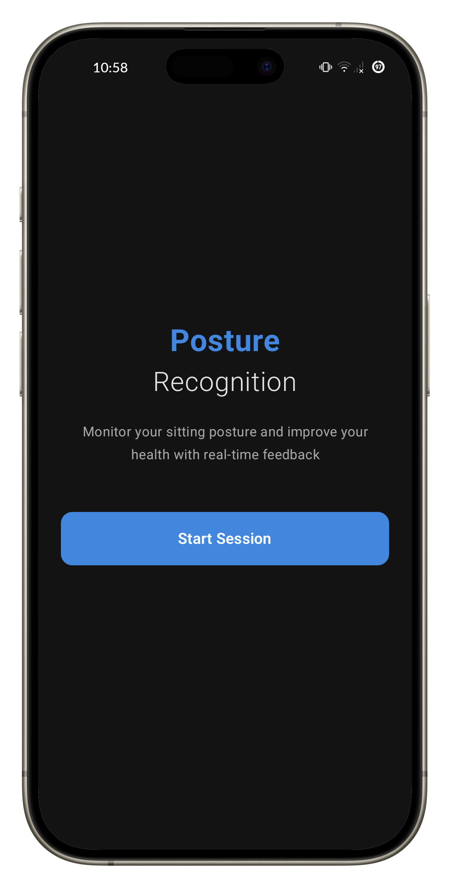
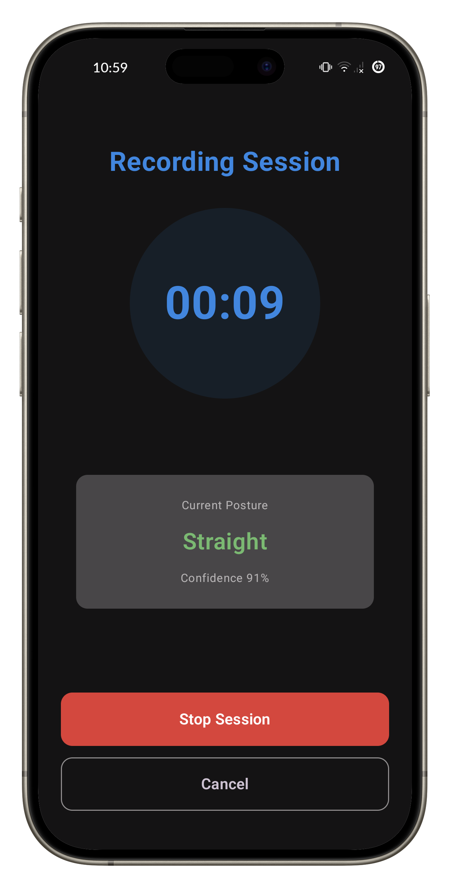
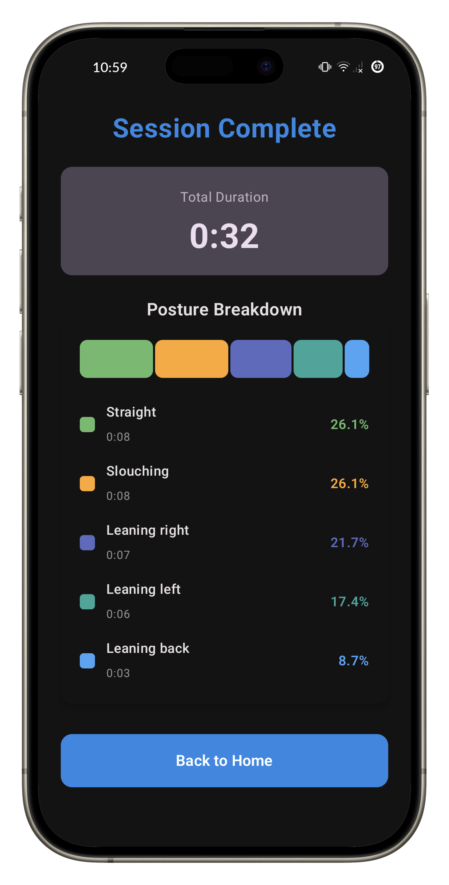

# T28: Real-Time Posture Recognition System

[](https://developer.android.com/)
[](https://kotlinlang.org/)
[](https://developer.android.com/jetpack/compose)
[](https://onnxruntime.ai/)

A mobile application that uses smartphone sensors and machine learning to detect sitting posture in real-time.

## 📱 Demo

### Screenshots




### Videos

[](https://youtu.be/e_ar3JpKpNY)

[](https://youtu.be/SNtVTkH4zmA)

---

## Overview

**Problem:** Poor sitting posture leads to musculoskeletal disorders, pain, and reduced productivity. Traditional solutions are expensive, reactive, and not scalable for continuous monitoring.

**Solution:** T28 uses smartphone sensors (accelerometer, gyroscope, gravity, orientation) and an on-device ML model to continuously monitor and classify sitting posture. The phone is mounted on the user's chest to capture upper body orientation, providing immediate feedback and session analytics.

---

## Technical Approach

### Posture Classes
| Class | Description |
|-------|-------------|
| **Straight** | Upright, neutral spine alignment |
| **Slouching** | Forward head, rounded shoulders |
| **Leaning Back** | Reclined, excessive lumbar extension |
| **Leaning Left** | Lateral deviation left |
| **Leaning Right** | Lateral deviation right |

### ML Pipeline

**Sensors:** Accelerometer, Gyroscope, Gravity, Orientation (10 Hz sampling)

**Feature Engineering:**
- Time bucketing: 0.1s windows
- PCA: 9 motion features → 2 components
- Final vector: 8 features (PCA mean/std, Pitch mean/std, Yaw mean/std)
- Sliding window: 2-second windows
- Normalization: Min-max scaling

**Model:**
- Algorithm: Random Forest Classifier
- Framework: scikit-learn → ONNX
- Inference: < 100ms on-device

---

## Architecture

### Tech Stack
- **Android:** Kotlin, Jetpack Compose, Material 3, MVVM
- **ML:** scikit-learn, ONNX Runtime Android
- **Sensors:** Accelerometer, Gyroscope, Gravity, Rotation Vector

### Project Structure
```
T28/app/src/main/java/com/example/t28/
├── MainActivity.kt
├── data/PostureData.kt
├── ml/
│   ├── PostureDetectionManager.kt    # ML orchestration
│   ├── SensorDataAggregator.kt       # Sensor data collection
│   └── ModelParams.kt                # Config loader
├── ui/screens/
│   ├── HomeScreen.kt
│   ├── RecordingScreen.kt
│   └── ResultsScreen.kt
└── viewmodel/SessionViewModel.kt

ML/
├── Desk_Posture_Preprocessing.ipynb  # Training pipeline
├── posture_model.onnx                # Model
└── model_params.json                 # Feature config
```

---

## Setup & Installation

### Build the App
```bash
git clone <repository-url>
cd "Final Project/T28"
./gradlew build
./gradlew assembleRelease  # APK at app/build/outputs/apk/release/
```

### Train the Model (Optional)
```bash
cd ML
pip install pandas numpy scikit-learn matplotlib skl2onnx onnxruntime openpyxl
jupyter notebook Desk_Posture_Preprocessing.ipynb
# Copy posture_model.onnx and model_params.json to T28/app/src/main/res/raw/
```

---

## Usage

### Hardware Setup
Phone must be mounted on chest using a [chest mount harness](https://www.amazon.in/Sounce-Mobile-Harness-Holder-Compatible/dp/B0CMJ4Y5GK/) for accurate posture detection.

### Instructions
1. Secure phone on chest using chest mount
2. Launch app and tap "Start Session"
3. Monitor real-time posture with color feedback
4. Tap "Stop Session" to view analytics

**Color indicators:** Green (Straight), Orange (Slouching), Blue (Leaning Back), Teal (Leaning Left), Indigo (Leaning Right)


---

## Known Limitations

- Phone must be secured on chest using a chest mount (not pocket/desk)
- No personalized calibration
- Limited to 5 posture classes

## 📄 License

Licensed under GNU AGPL v3.0 - see [LICENSE](LICENSE) for details.
- ✅ Free for educational and non-commercial use
- 💼 Commercial licensing available
